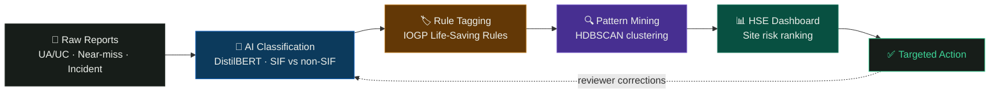

<div align="center">

# 🛡️ SIF-GUARD

### AI/NLP Engine for Serious Injury & Fatality (SIF) Precursor Detection

**Built for Smart India Hackathon 2026 · Problem Statement SIH26165 · Oil India Limited**

*Most safety reports get triaged monthly. The 20–25% that predict a fatality don't have that kind of time.*

<br/>


<br/>

[**🔗 Live Demo**](#) · [**📋 Problem Statement**](#-the-problem) · [**⚙️ Setup**](#️-getting-started) · [**🧭 Architecture**](#-architecture)

</div>

<br/>

---

## 📖 The Problem

> Oil India Limited (OIL) collects thousands of Unsafe-Act / Unsafe-Condition observations, near-miss reports, and incidents through its HSSE platform — but they're triaged **manually**, in batches, monthly or quarterly.
>
> Global safety research (DEKRA · Martin & Black 2015, Edison Electric Institute's SIF Precursor model, VelocityEHS 2024) shows something counter-intuitive: **low-severity incidents don't share the same root causes as fatalities.** Over 15 years, non-fatal incidents fell 51% — but fatalities fell only 25.5%. Generic safety improvement doesn't touch the ~20–25% of reports that actually carry fatal potential.
>
> **SIF-Guard finds that 20–25%, in real time — not next quarter.**

<br/>

## ✨ What It Does

<table>
<tr>
<td width="33%" valign="top">

### 🧠 Classify
Reads free-text UA/UC, near-miss, and incident reports and scores each as **SIF-potential** vs **non-SIF-potential** — based on what *could* have happened, not just the actual outcome.

</td>
<td width="33%" valign="top">

### 🏷️ Tag
Auto-maps every SIF-potential report to the relevant **IOGP Life-Saving Rule** — Energy Isolation, Hot Work, Confined Space, Line of Fire, and more.

</td>
<td width="33%" valign="top">

### 📊 Surface
An interactive dashboard ranks **sites and activities by SIF-precursor density**, so HSE teams know exactly where to intervene first.

</td>
</tr>
</table>

<br/>

## 🎯 Why It's Different

| | Generic AI Safety Tool | SIF-Guard |
|---|---|---|
| **Scoring basis** | Actual outcome severity | *Potential* severity — the real DEKRA/EEI distinction |
| **Explainability** | Black-box confidence score | Highlights the exact phrases driving every call |
| **Output** | Flags single reports | Clusters recurring activity/location/barrier-failure patterns |
| **Over time** | Static model | Active-learning loop — HSE reviewer corrections retrain it |
| **Framework fit** | Generic risk categories | Maps directly to IOGP Life-Saving Rules OIL already uses |

<br/>

## 🧭 Architecture



<br/>

## 🏗️ Tech Stack

<div align="center">

| Layer | Technology |
|---|---|
| **Frontend** | React 19 · Vite · Tailwind CSS · Framer Motion |
| **Backend API** | Node.js · Express · JWT Auth |
| **AI / NLP Microservice** | Python · FastAPI · HuggingFace Transformers (DistilBERT) · spaCy |
| **Database** | MongoDB |
| **Deployment** | Vercel (frontend) |

</div>

<br/>

## 🎬 Demo

> 🎥 *Add a GIF or screen recording of the login → dashboard → drill-down flow here — this is the single highest-impact thing you can add to this README.*

<div align="center">

| Access Terminal (Login) | Precursor Dashboard |
|---|---|
|  |  |

</div>

**Try it yourself** — the demo uses a role selector instead of real accounts:
```
Email:    anything@oil-india.com
Password: anything (type "fail" anywhere in it to see the denied-access state)
Role:     HSE Officer / Site Supervisor / Admin
```

<br/>

## ⚙️ Getting Started

```bash
# Clone the repo
git clone https://github.com/<your-org>/sif-guard.git
cd sif-guard/sif-guard-client

# Install dependencies
npm install

# Run the dev server
npm run dev
```

The app runs at `http://localhost:5173`. This build runs against realistic **fixture data** (`src/data/fixtures.js`) — no backend required to explore the full UI.

<br/>

## 📁 Project Structure

```
sif-guard-client/
├── src/
│   ├── api/           # Typed mock API layer — mirrors the real REST contract 1:1
│   ├── data/           # Fixture Report/Site/User data
│   ├── context/         # Auth session state
│   ├── components/       # Reusable UI — ProtectedRoute, ScanHero, LoginBackground, etc.
│   └── pages/            # Landing, Login, Dashboard, Reports, DrillDown, Upload, Export, Admin
└── public/                # Static assets
```

<br/>

## 🗺️ Roadmap

- [x] Frontend UI against realistic mock data
- [x] Explainable classification view with phrase highlighting
- [x] Site risk dashboard + drill-down
- [ ] Wire real Node/Express + MongoDB backend
- [ ] Deploy Python FastAPI microservice with fine-tuned DistilBERT classifier
- [ ] Live active-learning retraining loop from reviewer corrections
- [ ] Multilingual report ingestion (Hindi / Assamese)

<br/>

## 📚 References

1. Martin, D.K. & Black, A. (2015). *Preventing Serious Injuries and Fatalities: Study Reveals Precursors and Paradigms.* Professional Safety, 60(9), 35–43.
2. DEKRA — Serious Injury and Fatality (SIF) Prevention Services
3. Edison Electric Institute — Safety Classification and Learning (SCL) Model
4. IOGP Report 459 — Life-Saving Rules

<br/>

## 👥 Team

<div align="center">

**MeridianX** · SIH 2026 · Team ID `<XXXXXX>`

Saubhagya · Ayush · Sarthak · Nikhil · Shambhavi · Aditya

</div>

<br/>

---

<div align="center">

*Built for Smart India Hackathon 2026 — Problem Statement SIH26165*

</div>
